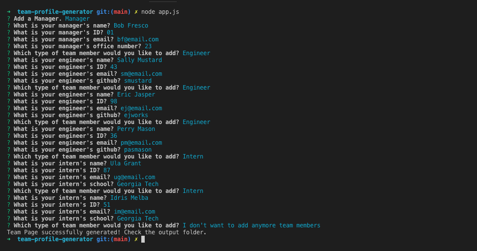

# Team Profile Page 🛗 Generator 

## Description 
A command-line application that generates a high quality team profile html page. The contents of the team page is generated by user prompts and feedback. This app allows a manager who doesn't know html to quickly create a team page.

## Table of Contents
* [Installation](#installation)
* [Usage](#usage)
* [Credits](#credits)
* [License](#license)
* [Features](#features)
* [Contributing](#contributing)
* [Tests](#tests)
* [Badges](#badges)

## Installation
### Steps required to run locally
1. Clone/download the code in this repo
2. Navigate to the location of the code downloaded
3. Double-click on the html file provided in the downloaded code to preview
### Steps required to run online
1. Click the "VIEW SITE" link at the bottom of this README

## Usage 
This code should be used for the purpose of creating/editing code for a Team Page generator. This code has not been deployed to a live site. It must be run locally.  
### Generator Screenshot  
  
### Team Page Screenshot  

## Credits
1 contributor: @stopdaydreaming  
Special thanks to my amazing tutor.

## License
Copyright (c) Team Profile Page Generator. All rights reserved.
Licensed under the [MIT License](LICENSE).

## Features
None at this time

## Contributing
None at this time

## Tests
Jest Tests

## Badges
